

# Pebbleㅇㅅㅇ;;

for Pebble Time 2

## 이게 뭔데

Pebbleㅇㅅㅇ;;은 제가 쓰려고 만든 PebbleOS의 **Pebble Time 2 전용** 커스텀 펌웨어입니다~~~~
PebbleOS의 Pull Request에서 괜찮아 보이는 기능, 잘 작동할 것 같은 기능을 제가 직접 골라왔습니다요.

## 뭐가 다른데

아래는 **A부터 J까지 쌓인 공개 펌웨어 기능**입니다. 최신 프리릴리즈는 [J · Jelly](https://github.com/devuterian/PebbleOAO/releases/tag/v4.37.0-ver010-jelly), 최신 정식 릴리즈는 [E · Egg Salad](https://github.com/devuterian/PebbleOAO/releases/tag/v4.37.0-ver005-egg-salad)입니다. F부터 J까지의 변경 사항까지 쓰시려면 프리릴리즈를 받아야 합니다요.

**한글과 폰트**

- **한글 번역을 넣었습니다.** 한글팩을 따로 설치하지 않아도 됩니다. 추가 기능이랑 날씨 화면, 테마 설정에 남아 있던 문구도 번역했습니다.
- **TUMBLED 기반 한글 폰트를 넣었습니다.** 한글 2,350자와 낱자 자모 94자가 들어 있습니다. `ㅋㅋ`, `ㅎㅎ`, `ㅠㅠ`도 됩니다. 다만 한글 11,172자를 전부 넣은 건 아니라 일부 드문 글자는 안 나올 수 있습니다.
- **내장 한글 폰트를 먼저 씁니다.** 기존 언어팩이 깔려 있어도 시스템의 한글은 펌웨어에 넣어둔 폰트로 나옵니다.
- **윈도우에서 자주 쓰는 특수문자도 채웠습니다.** `○`, `◯`가 네모로 나오던 부분을 고치고, 화살표·수학 기호·원문자·단위 등 빠져 있던 707자를 각 폰트에 추가했습니다. 모든 유니코드 문자가 들어간 건 아닙니다잉.
- **큰 글씨의 자모와 특수문자는 본고딕 계열로 맞췄습니다.** 큰 한글 본문 옆에 `ㅋㅋ`, `ㅎㅎ`, `ㅠㅠ`나 겹자음이 와도 덜 따로 놀게 했습니다. 작은 글씨는 기존 모양을 유지했습니다.
- **이모지 폰트에 없다고 바로 포기하지 않습니다.** 일반 폰트에 있는 기호라면 거기서 찾아서 보여주도록 고쳤습니다.

**화면과 메뉴**

- **손바닥으로 화면을 덮으면 워치페이스로 돌아갑니다.** 알림이나 다른 화면을 보고 있을 때 덮으면 백라이트를 끄고 시계 화면으로 돌아갑니다. 중요한 경고나 알람은 함부로 닫지 않으며, 싫으시면 설정에서 끄셔도 됩니다.
- **시스템 다크 모드를 넣었습니다.** 계속 켜둘 수도 있고, 주변 밝기나 정해둔 시간에 맞춰 바뀌게 할 수도 있습니다.
- **크게 설정하면 앱 서랍과 알림 목록도 같이 커집니다.** 앱 이름, 알림 제목과 미리보기도 좀 더 편하게 볼 수 있습니다.
- **큰 글씨는 두고 여백을 줄였습니다.** 설정과 알림 목록에서 한 화면에 더 많은 항목이 보이게 했습니다.
- **기본 워치페이스가 바로 꺼지던 문제를 고쳤습니다.** 다크 모드가 꺼져 있어도 생기던 오류였습니다. 메뉴 선택 표시와 음악 화면의 대비, 앱에서 쓰는 상태 표시줄 색상도 같이 바로잡았습니다.

**건강과 타임라인**

- **수면 시간이 이제 `7시간 32분`처럼 나옵니다.** 시간이 길어도 한글 단위가 깨지지 않도록 고쳤습니다.
- **“평소 수”를 “수요일 평균”으로 고쳤습니다.** 대체 무슨 수인가 싶었는데 요일별 평균이었습니다. 다른 요일도 같이 고쳤습니다.
- **운동 기록의 시간 표시도 손봤습니다.** 한글 시간이 잘리던 문제와 문구를 담는 공간이 부족할 때 잘못 처리하던 부분을 고쳤습니다.
- **날짜에 빠졌던 ‘일’을 붙였습니다.** 타임라인에 `9월 9` 대신 `9월 9일`처럼 나옵니다. 일출·일몰 문구는 수정된 폰 앱에서도 한국어로 보내도록 했습니다.

**배터리와 충전 화면**

- **80% 충전 제한을 넣었습니다.** 켜두면 80%에서 충전을 멈추고, 77% 이하로 내려가면 다시 충전합니다. 100%까지 충전하고 싶으시면 꺼두시면 됩니다.
- **충전 화면은 세 가지 중에서 고릅니다.** 전부 표시, 순정 화면, 아이콘과 잔량만 표시가 있습니다. 순정 옵션은 원래 충전 화면을 그대로 씁니다.
- **배터리 잔량을 소수점까지 볼 수 있습니다.** 소수 자릿수와 갱신 간격을 설정할 수 있고, 소수점 아래는 조금 작게 표시합니다. 100%가 되면 그냥 `100%`로 나옵니다. 소수 자릿수가 많다고 실제 측정 정확도까지 그만큼 높아지는 건 아닙니다.
- **배터리가 받는 전력과 남은 충전 시간을 한 줄로 보여줍니다.** 충전기 전체 소비 전력이 아니라 배터리 쪽 전력입니다. 80% 제한을 켰으면 80%까지, 껐으면 100%까지 남은 시간을 계산합니다. 자료가 부족하면 `계산 중`으로 나옵니다.
- **충전 상태도 말로 알려줍니다.** 제한에 도달하면 `충전 완료!`, 충전을 멈추고 재충전 기준까지 기다리는 동안에는 `완충 후 항해 중`이라고 나옵니다.
- **충전 아이콘도 계속 움직입니다.** 화면이 닫히거나 다른 화면에 가려지면 애니메이션은 쉬게 했습니다. 전부 표시 모드의 시계는 12시간·24시간 설정을 따라갑니다.
- **전력과 남은 시간은 아직 다듬는 중입니다.** F부터 들어간 프리릴리즈 기능입니다. 에뮬레이터의 표시 확인과 실제 충전 측정은 다른 얘기라, 실사용 중 이상하면 알려주세요.

**소리와 진동**

- **메뉴를 넘길 때 키음이 나게 할 수 있습니다.** 앱 서랍 열기, 이동, 선택, 뒤로 가기와 설정 적용에 각각 소리를 붙였습니다. 처음에는 꺼져 있어요.
- **키음과 정각 알림 음량을 따로 고릅니다.** 각각 1~5단계로 정할 수 있습니다. 배터리 부족과 방해금지 해제 소리도 키음 안의 상태 알림음에서 켤 수 있어요.
- **소리가 바뀔 때 섞이던 잡음을 손봤습니다.** 연속 입력 때 파형이 튀던 계산을 고치고, 정각 알림에도 쓰는 스피커 시작·종료 순서를 바꿨습니다. 실제 시계에서 남는 잡음은 더 확인해야 합니다.

- **정각에 소리가 나게 할 수 있습니다.** 1시간이나 30분 간격, 몇 시부터 몇 시까지 울릴지도 설정할 수 있습니다. 방해금지, 스피커 음소거, 저전력 상태, 펌웨어 업데이트 중, 다른 소리가 재생 중일 땐 안 울려요
- **진동 패턴 6개를 추가했습니다.** 중간 길이 두 번, 페블 모스 부호, 심장 박동, 더블 탭, 물결, (스타워즈) 제국 행진곡이 추가되었습니다.

**알림 아이콘**

- **앱 알림 아이콘 14개를 추가했습니다.** ChatGPT, 네이버, 네이버 카페, 당근, 토스, 중고나라, 네이버페이, 카카오페이, 쿠팡이츠, 디시인사이드, 폴센트, 하나페이, 뱅크샐러드, 셋로그가 들어 있습니다.
- **앱에 맞는 배경색도 같이 보냅니다.** Nagram XF는 텔레그램, Aliucord는 디스코드 아이콘으로 표시합니다.
- **새 아이콘은 수정된 안드로이드 앱도 필요합니다.** 펌웨어만 바꾸면 새 아이콘이 나오지 않습니다.

**테마와 건강 카드**

- **강조색을 고를 수 있습니다.** 빨강, 주황, 노랑, 초록, 청록, 파랑 계열, 보라, 자홍, 분홍과 반전을 지원합니다. 메뉴와 앱 서랍, 알림·워치페이스 목록에 같이 적용됩니다.
- **밝은 배경과 어두운 배경을 고를 수 있습니다.** 글씨와 시스템 아이콘 색도 같이 바뀝니다. 기존 시간·밝기 자동 다크 모드도 남겨뒀습니다.
- **큰 글씨가 적용되는 곳을 늘렸습니다.** 선택 메뉴와 워치페이스 목록, 블루투스 안내도 설정을 따릅니다. 앱 서랍의 배터리 아이콘도 크기를 맞췄어요.
- **건강 카드를 계속 넘길 수 있습니다.** 어느 버튼으로 열었든 마지막 카드 다음에 첫 카드로 돌아옵니다.

## 같이 쓰는 페블 앱은 뭐가 다른데

펌웨어 버전과 앱 버전은 따로 올라갑니다. **J 릴리즈에도 ver017 APK를 같이 올렸습니다.** F·G에 남아 있는 ver011보다 뒤의 버전이고, 아래 한국어 표시와 앱 업데이트 기능도 포함됩니다요.

**공개 APK에 들어간 기능**

- **한국어 지원!!!!!!**
- **Pebbleㅇㅅㅇ;;을 받을지 공식 펌웨어로 바꿀지 고를 수 있습니다.**
- **한국어 음성 입력 연결과 결과 처리를 손봤습니다.**
- **일출·일몰 알림도 한국어로 보냅니다.** Sunrise, Sunset 이런 식으로 나오길래 바꿨어요!
- **앱 자체 업데이트 확인을 넣었습니다.** GitHub의 새 APK를 자동으로 확인하고 알려줍니다.

**H에 같이 올린 앱에서 달라진 것들**

- **로그인과 배터리 통계의 빠진 설정을 채웠습니다.** ver013~ver015에서 원본 앱의 공개 로그인·대시보드·푸시·진단 설정을 비교해서 복구했습니다. 필수 설정이 빠지면 빌드가 실패하도록 검사도 넣었습니다. 그렇다고 모든 계정의 로그인이나 서버 응답까지 확인됐다는 뜻은 아닙니다.

- **GitHub 표 안의 사진도 나오게 고쳤습니다.** ver017에서는 ``로 넣은 사진도 앱이 읽고, 두 열짜리 표 안에서 보여줍니다. 릴리즈 글을 다른 형식으로 다시 쓸 필요는 없습니다. 제 폰에서도 사진이 나오는 걸 확인했습니다.

## A부터 뭐가 바뀌었는데

전부 **PebbleOS v4.37.0 기반 Time 2 펌웨어**입니다. Time·Time Steel 쪽 버전이나 개인용 폰트 실험 빌드와는 별개입니다. 기능이 들어온 순서만 쭉 적었습니다.

**[A · ver001 · Ang Butter Bread](https://github.com/devuterian/PebbleOAO/releases/tag/v4.37.0-ver001-ang-butter-bread) · 프리릴리즈**

- 손바닥으로 덮어서 워치페이스로 돌아가는 초기 작업에 한국어 번역과 TUMBLED 폰트, 낱자 자모를 합쳤습니다.
- 다크 모드, 80% 충전 제한, 추가 진동 6종, 정각 알림 소리를 넣었습니다. 여기서 시작했습니다잉.

**[B · ver002 · Brownie](https://github.com/devuterian/PebbleOAO/releases/tag/v4.37.0-ver002-brownie) · 프리릴리즈**

- 일부 워치페이스를 선택하면 바로 꺼지던 오류를 고쳤습니다. 다크 모드를 안 써도 생기던 문제였습니다.

**[C · ver003 · Cheesecake](https://github.com/devuterian/PebbleOAO/releases/tag/v4.37.0-ver003-cheesecake) · 정식 릴리즈**

- 한국에서 자주 쓰는 앱의 알림 아이콘 14개와 앱별 배경색을 추가했습니다.
- Nagram XF와 Aliucord도 각각 텔레그램·디스코드 아이콘으로 나오게 했습니다. 수정된 폰 앱이 같이 필요합니다.

**[D · ver004 · Donut](https://github.com/devuterian/PebbleOAO/releases/tag/v4.37.0-ver004-donut) · 정식 릴리즈**

- 건강 앱의 한글 수면 시간, 요일별 평균 문구, 운동 기록의 시간 잘림을 고쳤습니다.

**[E · ver005 · Egg Salad](https://github.com/devuterian/PebbleOAO/releases/tag/v4.37.0-ver005-egg-salad) · 정식 릴리즈**

- 앱 서랍·알림 목록에도 큰 글씨를 적용하고, 설정·알림 항목의 위아래 여백을 줄였습니다.
- 타임라인 날짜의 ‘일’과 남아 있던 한국어 번역을 보완했습니다. 앱 상태 표시줄 색상 호환성도 바로잡았습니다.
- 함께 올린 앱에 최신 정식 펌웨어 조회와 음성 입력 연결·결과 처리 수정을 넣었습니다.

**[F · ver006 · Flan](https://github.com/devuterian/PebbleOAO/releases/tag/v4.37.0-ver006-flan) · 프리릴리즈**

- 충전 화면 세 가지, 소수점 잔량, 배터리 전력과 남은 시간, 시계 표시를 넣었습니다.
- 충전 아이콘 반복 애니메이션과 80% 제한 상태 문구를 넣고, 충전 설정을 바꾸면 선택 표시도 바로 바뀌도록 고쳤습니다.
- 앱에는 프리릴리즈 동의와 공식 업데이트 경로 선택이 들어갔습니다. 이후 첨부 APK를 ver011로 갱신하면서 업데이트 설명의 사진·GIF·볼드와 작은 스크린샷 확대도 반영했습니다.

**[G · ver007 · Gelato](https://github.com/devuterian/PebbleOAO/releases/tag/v4.37.0-ver007-gelato) · 프리릴리즈**

- 동그라미가 네모로 나오던 문제와 윈도우 특수문자 누락을 고쳤습니다.
- 큰 글씨의 특수문자·낱자 자모·겹자음을 본고딕 계열로 맞추고, 이모지 폰트에 없는 기호를 일반 폰트에서 찾도록 고쳤습니다.
- 특수문자를 확인한 에뮬레이터 화면 33장을 릴리즈에 올렸습니다. 첨부 APK는 F와 같은 ver011입니다.

**[H · ver008 · Honey Toast](https://github.com/devuterian/PebbleOAO/releases/tag/v4.37.0-ver008-honey-toast) · 프리릴리즈**

- uaparit님의 테마 기능을 가져와 강조색·밝은 배경·어두운 배경·반전을 고를 수 있게 했습니다.
- 메뉴와 앱 서랍, 알림·워치페이스 목록의 색을 맞추고 설정 아이콘을 켰습니다.
- 큰 글씨를 지원하는 화면과 배터리 아이콘 크기 조절을 추가했습니다. 기존 촘촘한 메뉴 간격은 유지했습니다.
- 건강 카드는 마지막에서 처음으로 계속 넘길 수 있습니다.
- 앱 ver017을 같이 올렸습니다. 한국어 표시, 앱 자체 업데이트, 로그인·배터리 통계 설정 보완, 표 안 사진 표시 수정이 들어갑니다.

**[I · ver009 · Ice Cream](https://github.com/devuterian/PebbleOAO/releases/tag/v4.37.0-ver009-ice-cream) · 프리릴리즈**

- 키음과 상태 알림음을 넣고, 키음·정각 알림 음량을 각각 1~5단계로 고를 수 있게 했습니다.
- 연타할 때 소리가 튀던 계산과 스피커 시작·종료 순서를 손봤습니다. APK는 H와 같은 ver017입니다.

**[J · ver010 · Jelly](https://github.com/devuterian/PebbleOAO/releases/tag/v4.37.0-ver010-jelly) · 프리릴리즈**

- 건강 앱의 심장 애니메이션이 다크 모드 색을 입힐 때 시계가 재부팅되던 문제를 고쳤습니다.
- 80% 충전 제한을 쓰지 않을 때도 1분마다 돌아가던 확인 작업을 멈췄습니다. 충전 제한을 켜고 실제로 충전 중일 때만 확인합니다.
- Time 2 실기기에 설치해 부팅, 한국어, BLE 재연결과 앱 동기화까지 확인했습니다. APK는 I와 같은 ver017입니다.

## 스크린샷

왼쪽은 **순정 PebbleOS v4.37.0**, 오른쪽은 **Pebbleㅇㅅㅇ;; Flan**입니다.
양쪽 모두 글자 크기는 **크게**입니다.

**앱 서랍**

| 순정 | Pebbleㅇㅅㅇ;; |
| :---: | :---: |
| 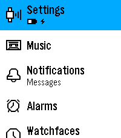 | 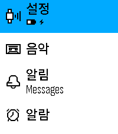 |
| 글자를 크게 설정해도 앱 이름은 작은 편입니다. | 앱 이름도 같이 커지고, 메뉴를 한글로 볼 수 있습니다. |

**설정 메뉴**

| 순정 | Pebbleㅇㅅㅇ;; |
| :---: | :---: |
| 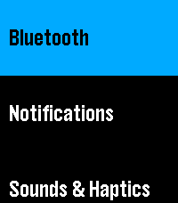 | 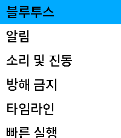 |
| 메뉴 사이가 넓어서 한 화면에 보이는 항목이 적습니다. | 글씨는 크게 두고 간격을 줄여 더 많은 항목이 보이게 했습니다. |

**한글 알림과 앱 아이콘**

| 순정 | Pebbleㅇㅅㅇ;; |
| :---: | :---: |
| 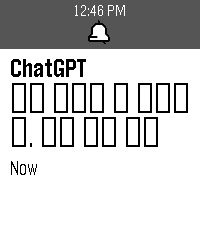 | 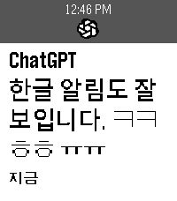 |
| 별도 한글팩이 없으면 한글이 네모로 나오고, ChatGPT는 기본 아이콘을 씁니다. | 한글과 낱자 자모가 나오고, 수정된 폰 앱과 함께 쓰면 ChatGPT 아이콘도 뜹니다. |

**알림 목록**

| 순정 | Pebbleㅇㅅㅇ;; |
| :---: | :---: |
| 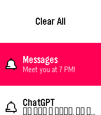 |  |
| 목록의 제목과 내용은 작은 글씨로 표시됩니다. | 목록에도 큰 글씨 설정을 적용하고 항목 사이의 간격을 줄였습니다. |

**건강 앱**

| 순정 | Pebbleㅇㅅㅇ;; |
| :---: | :---: |
| 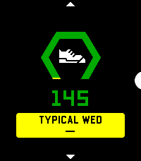 | 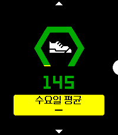 |
| 요일별 비교가 “TYPICAL WED”처럼 영어로 나옵니다. | 비교 대상에 맞춰 “수요일 평균”처럼 한국어로 표시합니다. |

**충전 화면**

| 순정 | Pebbleㅇㅅㅇ;; |
| :---: | :---: |
| 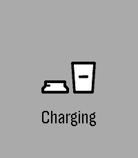 | 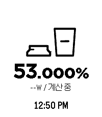 |
| 충전 아이콘과 “Charging” 문구를 보여줍니다. | 잔량·배터리 전력·남은 시간·시계를 표시하고, 소수점은 조금 작게 넣었습니다. |

**충전 설정**

| 순정 | Pebbleㅇㅅㅇ;; |
| :---: | :---: |
|  | 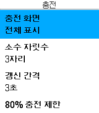 |
| 충전 화면의 표시 항목을 고르는 메뉴는 없습니다. | 표시 방식·소수 자릿수·갱신 간격·80% 충전 제한을 설정할 수 있습니다. |

**다크 모드**

| 순정 | Pebbleㅇㅅㅇ;; |
| :---: | :---: |
|  | 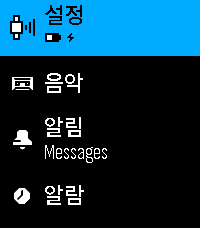 |
| 앱 서랍은 밝은 배경으로 표시됩니다. | 어두운 배경으로 바꿀 수 있고, 시간이나 주변 밝기에 맞춰 전환할 수도 있습니다. |

**정각 알림 소리**

| 순정 | Pebbleㅇㅅㅇ;; |
| :---: | :---: |
| 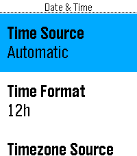 | 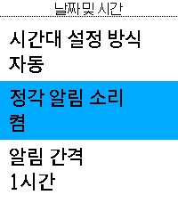 |
| 날짜와 시간 메뉴에는 시간 표시와 시간대 설정이 있습니다. | 스피커로 정각을 알리도록 켜고, 간격과 소리가 날 시간을 정할 수 있습니다. |

**진동 패턴**

| 순정 | Pebbleㅇㅅㅇ;; |
| :---: | :---: |
| 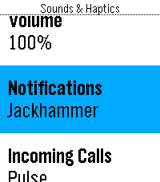 | 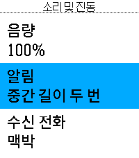 |
| 기본으로 들어 있는 진동 패턴 중에서 고릅니다. | 중간 길이 두 번을 포함해 새 진동 패턴 6가지를 더 골라 쓸 수 있습니다. |

**손바닥으로 덮기**

| 순정 | Pebbleㅇㅅㅇ;; |
| :---: | :---: |
| 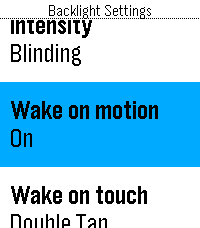 | 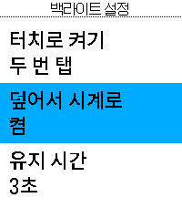 |
| 움직임이나 터치로 백라이트를 켜는 설정이 있습니다. | 화면을 덮으면 백라이트를 끄고 워치페이스로 돌아가게 할 수 있습니다. |

**G에서 보강한 특수문자**

위 비교 사진은 F 때 찍은 화면이고, 아래는 G에서 추가로 확인한 화면입니다. [33장 전체는 G 릴리즈](https://github.com/devuterian/PebbleOAO/releases/tag/v4.37.0-ver007-gelato)에서 볼 수 있습니다. 순정과 비교해 새로 찍은 사진은 아니라 여기서는 문자 확인 화면끼리 나란히 뒀습니다.

| Gelato 특수문자 확인 1 | Gelato 특수문자 확인 2 |
| :---: | :---: |
| 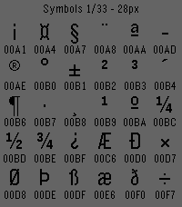 | 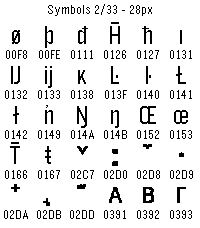 |
| 추가한 특수문자가 실제 글꼴에서 나오는지 확인했습니다. | 나머지 기호들도 페이지를 나눠 확인했습니다. |

## 조잡해보이는데

네. 제가 쓰려고 만들었기 때문에 조잡합니다. 그래서 (혹시나 버그가 생긴다면) 알람이 안 울린다든지 뭐 어쩐다든지 할 수 있습니다. 이 레포지토리의 모든 파일을 Pebble, 또는 안드로이드 폰에 적용시 물적, 심적인 책임은 이용자에게 전부 있음을 인정한다고 간주합니다.

그렇지만 제가 쓰려고 만들었기 때문에 잘 작동 안 되는 건 제가 용서를 못 합니다. [이슈](https://github.com/devuterian/PebbleOAO/issues)를 보내주시면 최대한 수정해볼 수 있도록 노력하겠습니다.

## 까는 법

에이 페블 쓰시는 분이면 아시지 않나요? (아니면 죄송합니다 제미나이에게 물어보세요)

파일은 [릴리즈 페이지](https://github.com/devuterian/PebbleOAO/releases)에 있습니다. 본인 기종에 맞는 걸 받아주세요.

한글 번역과 폰트가 포함돼 있어서 별도 한글팩은 필요하지 않습니다잉.
시계 언어 설정에서 **한국어**를 선택하면 됩니다.
언어팩이 이미 깔려 있어도 괜찮습니다. 똑같이 한국어를 선택하면 됩니다.

**H에서 추가한 테마**

| 빨간 강조색 · 밝은 배경 | 빨간 강조색 · 어두운 배경 |
| --- | --- |
| 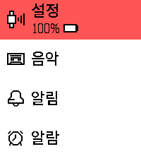 | 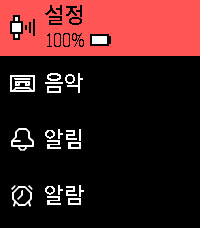 |
| 밝은 배경에 빨간 강조색을 쓸 수 있습니다. | 배경을 어둡게 바꾸면 글씨와 시스템 아이콘도 같이 바뀝니다. |

[반전 테마와 나머지 화면도 H 릴리즈에서 볼 수 있습니다.](https://github.com/devuterian/PebbleOAO/releases/tag/v4.37.0-ver008-honey-toast)

## 가져온 프로젝트들

- **[uaparit/PebbleOS](https://github.com/uaparit/PebbleOS/tree/v4.36.2-ua1.4)** 테마, 큰 글씨 적용 범위 확대, 배터리 아이콘 크기 조절과 건강 카드 순환을 가져왔습니다. 기존 자동 다크 모드와 한글 메뉴에 맞춰 합쳤습니다.

여러 분이 만들어주신 코드와 리소스를 가져와 제 취향에 맞게 수정했습니다. 만들어주신 분들께 진심으로 감사드립니다.

- **[PebbleOS](https://github.com/coredevices/PebbleOS)** 이 펌웨어의 바탕이 된 프로젝트입니다.
- **[josiahcbloomer · #1979](https://github.com/coredevices/PebbleOS/pull/1979)** 손바닥으로 덮으면 백라이트가 꺼지는 기능을 가져와, 워치페이스로도 돌아가도록 수정했습니다.
- **[spr4bhu · #1156](https://github.com/coredevices/PebbleOS/pull/1156)** 배터리 충전을 80%로 제한하는 기능을 가져왔습니다.
- **[amcolash · #1119](https://github.com/coredevices/PebbleOS/pull/1119)** 시스템 다크 모드를 가져오고, 사용 중 발견한 문제를 수정했습니다.
- **[Joshsg3 · #1982](https://github.com/coredevices/PebbleOS/pull/1982)** 추가 진동 패턴을 가져오고 설정 문구를 한국어로 번역했습니다.
- **[pebble-korean-language-pack](https://github.com/devuterian/pebble-korean-language-pack)** 한글 번역을 가져와 기반 버전에 맞추고, 추가 기능의 문구를 번역했습니다.
- **[TsFreddie/TUMBLED](https://github.com/TsFreddie/TUMBLED)** 내장 폰트로 넣었습니다. 저장 공간에 맞춰 글자 구성을 조정하고, 빠진 낱자 자모는 Galmuri로 보완했습니다.
- **[quiple/Galmuri](https://github.com/quiple/galmuri)** 작은 글씨의 낱자 자모와 특수문자를 보완할 때 썼습니다.
- **[Adobe Source Han Sans · 본고딕](https://github.com/adobe-fonts/source-han-sans)** 큰 글씨의 낱자 자모와 특수문자에 사용했습니다.
- **[coredevices/mobileapp](https://github.com/coredevices/mobileapp)** 함께 쓰는 안드로이드 앱의 바탕입니다.
- **[multiplatform-markdown-renderer](https://github.com/mikepenz/multiplatform-markdown-renderer)** 폰 앱에서 업데이트 설명의 마크다운·사진·GIF를 보여줄 때 사용합니다. 표 안 HTML 사진 처리는 앱 쪽에서 보완했습니다.
- **[iconography 포크](https://github.com/devuterian/iconography)** 기존 아이콘에 한국에서 자주 쓰는 앱의 알림 아이콘을 추가했습니다.

## 라이선스

PebbleOS의 기본 라이선스는 [Apache License 2.0](LICENSE)입니다.
포함된 폰트, 아이콘, 외부 코드에는 별도 라이선스가 적용될 수 있습니다. 각 파일과 폴더의 라이선스 및 출처 안내를 확인해주세요.
